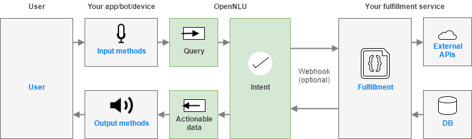

# OpenNLU - Open Source Conversational AI

> There is currently no release candidate available.

OpenNLU (Natural Language Understanding) is a tool for intent classification and entity extraction. You can think of OpenNLU as a set of high level APIs for building your own language parser using existing NLP and ML libraries.

OpenNLU is used to build next-generation bots and assistants that engage in human-like, layered conversations.

## Contents

- [Setup](#setup) 
- [How to contribute](#how-to-contribute)
- [License](#license)

## Setup

A tutorial for the installation & configuration can be found in our [Wiki](https://github.com/OpenNLU/OpenNLU/wiki)

## How to contribute

We are very happy to receive and merge your contributions. There is some more information about the style of the code and docs in the [CONTRIBUTING.md](CONTRIBUTING.md) file.

## License

All Rights Reserved. [Copy of the license](LICENSE).