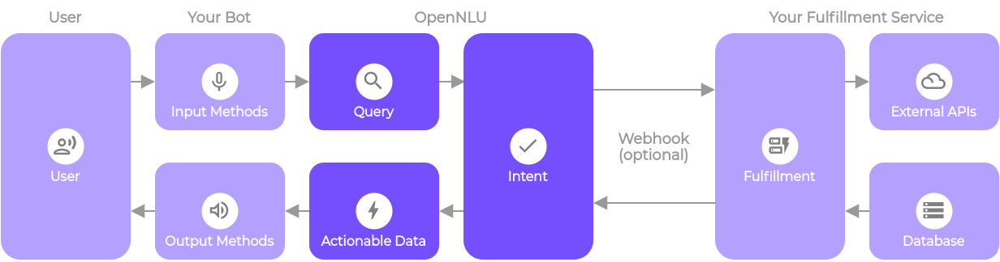
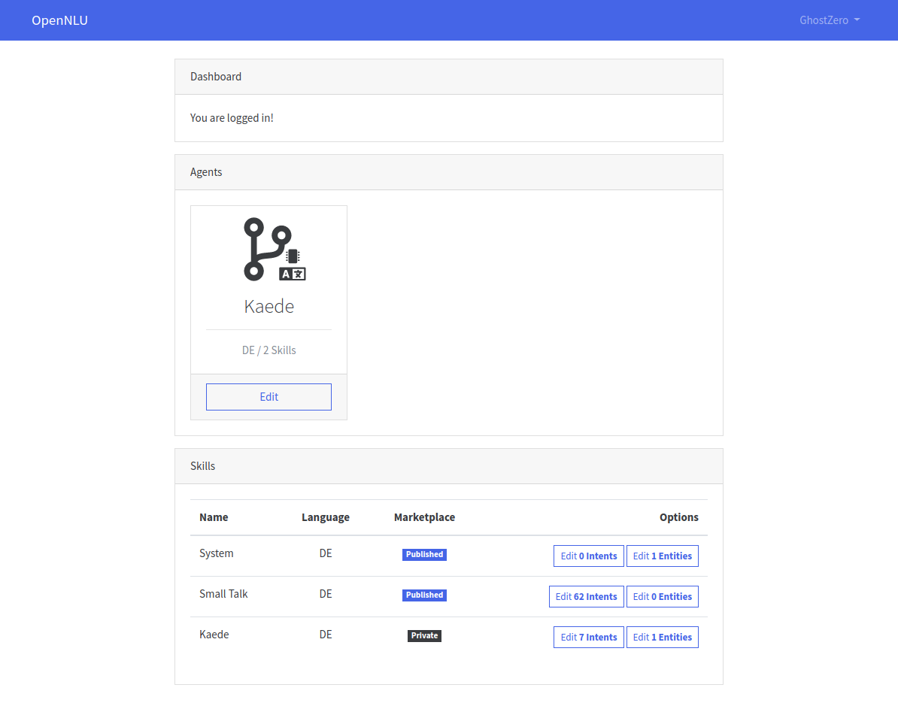
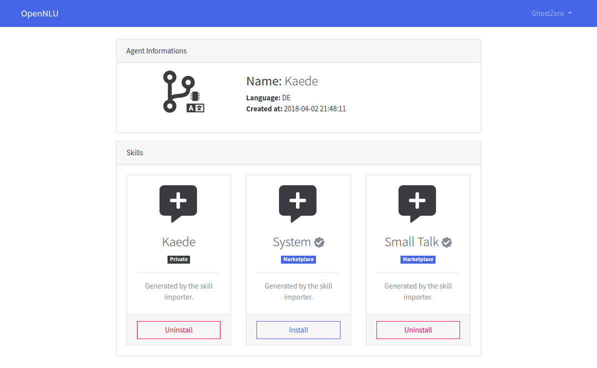
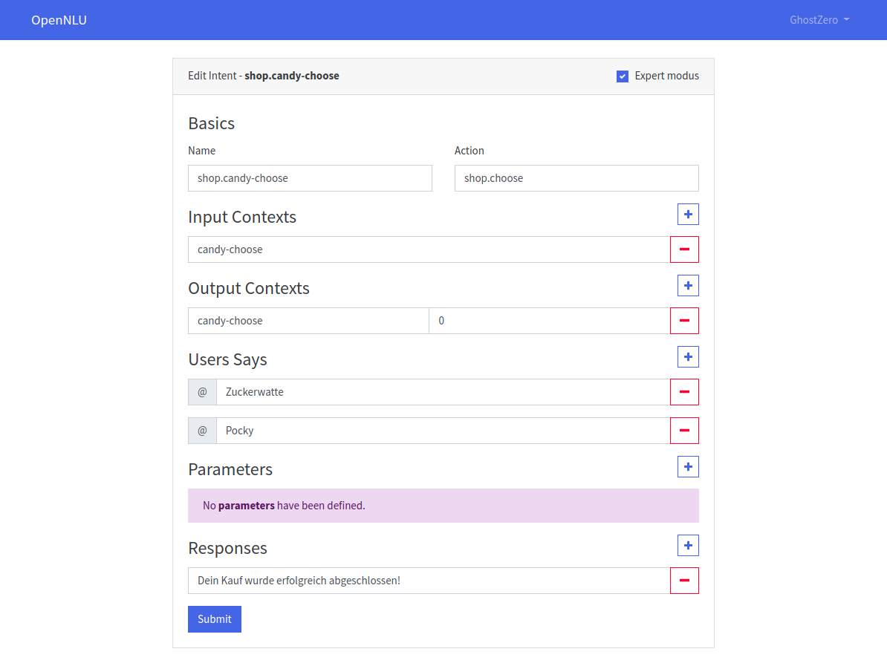

# OpenNLU - Open Source Conversational AI

> There is currently no release candidate available.

OpenNLU (Natural Language Understanding) is a tool for intent classification and entity extraction. You can think of OpenNLU as a set of high level APIs for building your own language parser using existing NLP and ML libraries.

OpenNLU is used to build next-generation bots and assistants that engage in human-like, layered conversations.

# Contents

- [OpenNLU Sponsors](#opennlu-sponsors) 
- [Screenshots](#screenshots) 
- [Setup](#setup)
- [Awesome OpenNLU](#awesome-opennlu)
- [How to contribute](#how-to-contribute)
- [License](#license)

## OpenNLU Sponsors

If you are interested in becoming a sponsor, please visit the OpenNLU [PayPal.Me page](https://www.paypal.me/preussio).

## Screenshots

> Here are some screenshots of the web interface, based on Laravel, Vue.js & Bootstrap. The web interface is not in this repository and will be published later.

## Setup

A tutorial for the installation & configuration can be found in our [Wiki](https://github.com/GhostZero/OpenNLU/wiki)

## Awesome OpenNLU

A curated list of libraries, tools, and integrations for OpenNLU.

Projects formatted in **bold** are official OpenNLU projects.

Want to have your project listed? Submit a Pull Request!

**Please note that while we try to only include projects in this list which are
functional and of good quality, we cannot provide any guarantee that they actually
work, are complete, nor that they do not cause any harm to your system or your account.**

### Tools

* **[OpenNLU-Dashboard](https://github.com/GhostZero/OpenNLU-Dashboard) — Official web agent, intent & entity editor**

### Libraries

#### PHP

* **[NLU-PHP-Client](https://git.preuss.io/KaedeAI/NLU-PHP-Client) — Official library for PHP**

#### Java

* **[NLU-Java-Client](https://git.preuss.io/KaedeAI/NLU-Java-Client) — Official library for Java**

## How to contribute

We are very happy to receive and merge your contributions. There is some more information about the style of the code and docs in the [CONTRIBUTING.md](CONTRIBUTING.md) file.

## License

MIT. [Copy of the license](LICENSE).
